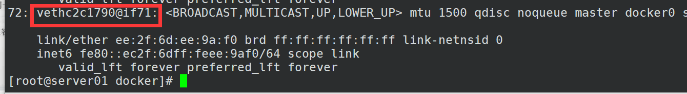

# Docker的安装

### 1.卸载老版本的docker

```shell
 sudo yum remove docker \
                  docker-client \
                  docker-client-latest \
                  docker-common \
                  docker-latest \
                  docker-latest-logrotate \
                  docker-logrotate \
                  docker-engine
                  注意要是原来没有安装过docker 这个可以直接跳过
```

### 2.设置docker的源：

```shell

$ sudo yum install -y yum-utils
$ sudo yum-config-manager \
    --add-repo \
    https://download.docker.com/linux/centos/docker-ce.repo
    
    国外不能使用参照这个：https://developer.aliyun.com/mirror/docker-ce?spm=a2c6h.13651102.0.0.3e221b11aJHYXN
    # step 1: 安装必要的一些系统工具
    sudo yum install -y yum-utils device-mapper-persistent-data lvm2
    # Step 2: 添加软件源信息
    sudo yum-config-manager --add-repo https://mirrors.aliyun.com/docker-ce/linux/centos/docker-ce.repo
    # Step 3
    sudo sed -i 's+download.docker.com+mirrors.aliyun.com/docker-ce+' /etc/yum.repos.d/docker-ce.repo
    # Step 4: 更新并安装Docker-CE
    sudo yum makecache fast
    sudo yum -y install docker-ce
    # Step 4: 开启Docker服务
    sudo service docker start
```

### 3.安装docker

```shell
 sudo yum install docker-ce docker-ce-cli containerd.io -y
```

### 4.设置docker的加速器

#### 4.1 Ubuntu加速器

```shell
sudo mkdir -p /etc/docker
sudo tee /etc/docker/daemon.json <<-'EOF'
{
  "registry-mirrors": ["https://2n9uoybw.mirror.aliyuncs.com"]
}
EOF
sudo systemctl daemon-reload
sudo systemctl restart docker

```

#### 4.2 Centos7加速器

```shell

sudo mkdir -p /etc/docker
sudo tee /etc/docker/daemon.json <<-'EOF'
{
  "registry-mirrors": ["https://2n9uoybw.mirror.aliyuncs.com"]
}
EOF
sudo systemctl daemon-reload
sudo systemctl restart docker
sudo systemctl status docker
```

注意事项：

​	最好使用Ubuntu进行安装主要是     存储的处理不好centos

**配置网络yum文件**

```shell
wget -O /etc/yum.repos.d/CentOS-Base.repo https://mirrors.aliyun.com/repo/Centos-7.repo
sed -i -e '/mirrors.cloud.aliyuncs.com/d' -e '/mirrors.aliyuncs.com/d' /etc/yum.repos.d/CentOS-Base.repo

出现报错就执行下面的操作
报错效果如下如图：
```


服务的开启和关闭

```shell
  sudo systemctl enable docker.service
  sudo systemctl enable containerd.service
```

设置开机不启动

```shell
$ sudo systemctl disable docker.service
$ sudo systemctl disable containerd.service
```

重新载入配置文件

```
 $ sudo systemctl daemon-reload
```

## 默认配置下，在 CentOS 使用 Docker 可能会碰到下面的这些警告信息：

```shell
WARNING: bridge-nf-call-iptables is disabled 
WARNING: bridge-nf-call-ip6tables is disabled 


添加内核配置参数以启用这些功能。 
$ sudo tee -a /etc/sysctl.conf <<-EOF 
net.bridge.bridge-nf-call-ip6tables = 1 
net.bridge.bridge-nf-call-iptables = 1 
EOF
```


## 菜鸟教程的案例：


第一个镜像的启动打印hello-word

```shell
docker run ubuntu:15.10 /bin/echo "Hello world"
```

解释为：Docker 以 ubuntu15.10 镜像创建一个新容器，然后在容器里执行 bin/echo "Hello world"，然后输出结果

```shell
[root@localhost docker]# docker ps -a 
CONTAINER ID   IMAGE          COMMAND                  CREATED          STATUS                      PORTS     NAMES
6c077839c0bf   ubuntu:15.10   "/bin/echo 'Hello wo…"   30 seconds ago   Exited (0) 28 seconds ago             dazzling_spence
[root@localhost docker]# 
执行完成后状态编程退出状态
```

### **创建交互式容器**

```
从容器的创建到容器的消亡  
[root@localhost docker]# docker run -it ubuntu:15.10 /bin/bash 
root@4d7eb6a361ac:/# pwd    显示容器内的目录结构
/
root@4d7eb6a361ac:/# uname -a    显示容器的架构
Linux 4d7eb6a361ac 3.10.0-862.el7.x86_64 #1 SMP Fri Apr 20 16:44:24 UTC 2018 x86_64 x86_64 x86_64 GNU/Linux
root@4d7eb6a361ac:/# 
root@4d7eb6a361ac:/# cat /proc/version    查看版本
Linux version 3.10.0-862.el7.x86_64 (builder@kbuilder.dev.centos.org) (gcc version 4.8.5 20150623 (Red Hat 4.8.5-28) (GCC) ) #1 SMP Fri Apr 20 16:44:24 UTC 2018
root@4d7eb6a361ac:/# exit
注意使用exit退出容器  容器的状态会变成退出状态  （Exited）

    -i 在容器内指定一个终端
    -t 允许你对容器内的标准输入进行交互
    
```


创建启动在后台的容器

```shell
[root@localhost docker]# docker run -d ubuntu:15.10 /bin/sh -c "while true; do echo hello world; sleep 1; done"
1547cef125e6729f73c9bdb04682bce061a75f34d0b1d06abc24be4eac52dd63
[root@localhost docker]# 
每个容器的id都是唯一的
[root@localhost docker]# docker ps -a 
CONTAINER ID   IMAGE          COMMAND                  CREATED              STATUS                     PORTS     NAMES
1547cef125e6   ubuntu:15.10   "/bin/sh -c 'while t…"   About a minute ago   Up About a minute //状态是up状态                   tender_booth
4d7eb6a361ac   ubuntu:15.10   "/bin/bash"              6 minutes ago        Up 6 minutes                         condescending_taussig
6c077839c0bf   ubuntu:15.10   "/bin/echo 'Hello wo…"   8 minutes ago        Exited (0) 8 minutes ago             dazzling_spence
[root@localhost docker]# 
docker ps介绍：
输出详情介绍：
CONTAINER ID: 容器 ID。
IMAGE: 使用的镜像。
COMMAND: 启动容器时运行的命令。
CREATED: 容器的创建时间。
STATUS: 容器状态。
状态有7种：
created（已创建）
restarting（重启中）
running 或 Up（运行中）
removing（迁移中）
paused（暂停）
exited（停止）
dead（死亡）
PORTS: 容器的端口信息和使用的连接类型（tcp\udp）。
NAMES: 自动分配的容器名称。
```

### 查看容器内的标准输出

```shell
[root@localhost docker]# docker logs 1547cef125e6 
hello world
hello world
hello world
```


### 停止容器

```shell
[root@localhost docker]# docker ps -a 
CONTAINER ID   IMAGE          COMMAND                  CREATED          STATUS                      PORTS     NAMES
1547cef125e6   ubuntu:15.10   "/bin/sh -c 'while t…"   5 minutes ago    Up 5 minutes                          tender_booth
4d7eb6a361ac   ubuntu:15.10   "/bin/bash"              10 minutes ago   Up 10 minutes                         condescending_taussig
6c077839c0bf   ubuntu:15.10   "/bin/echo 'Hello wo…"   12 minutes ago   Exited (0) 12 minutes ago             dazzling_spence
[root@localhost docker]# docker stop 1547cef125e6 //停止容器  或者使用容器名字 容器id
1547cef125e6
[root@localhost docker]# docker ps -a 
CONTAINER ID   IMAGE          COMMAND                  CREATED          STATUS                        PORTS     NAMES
1547cef125e6   ubuntu:15.10   "/bin/sh -c 'while t…"   5 minutes ago    Exited (137) 18 seconds ago             tender_booth
4d7eb6a361ac   ubuntu:15.10   "/bin/bash"              11 minutes ago   Up 11 minutes                           condescending_taussig
6c077839c0bf   ubuntu:15.10   "/bin/echo 'Hello wo…"   13 minutes ago   Exited (0) 13 minutes ago               dazzling_spence
[root@localhost docker]# 
```


### Docker中帮助命令的使用：

```
[root@localhost ~]#docker   //会显示帮助的命令
[root@localhost ~]# docker stat --help   显示命令的进一步的帮助命令   和普通linux使用语法是一样的

Usage:  docker [OPTIONS] COMMAND

A self-sufficient runtime for containers
```


## 容器的使用

**获取镜像**

```shell
[root@localhost ~]# docker pull ubuntu 
Using default tag: latest   //使用最新的标记  否则就会出现悬挂镜像
latest: Pulling from library/ubuntu
7b1a6ab2e44d: Pull complete 
Digest: sha256:626ffe58f6e7566e00254b638eb7e0f3b11d4da9675088f4781a50ae288f3322
Status: Downloaded newer image for ubuntu:latest
docker.io/library/ubuntu:latest
[root@localhost ~]# 
[root@localhost ~]# docker images 
REPOSITORY   TAG       IMAGE ID       CREATED       SIZE
ubuntu       latest    ba6acccedd29   5 days ago    72.8MB
nginx        latest    87a94228f133   9 days ago    133MB
ubuntu       15.10     9b9cb95443b5   5 years ago   137MB
[root@localhost ~]# 

```

**容器的创建**

```shell
[root@localhost ~]# docker run -it ubuntu /bin/bash      启动一个交互式容器
root@19094a8d30bd:/# 
root@19094a8d30bd:/# uname -a 
Linux 19094a8d30bd 3.10.0-862.el7.x86_64 #1 SMP Fri Apr 20 16:44:24 UTC 2018 x86_64 x86_64 x86_64 GNU/Linux
root@19094a8d30bd:/# exit
exit
[root@localhost ~]# 
```

​	

**查看已经启动的容器**

```
[root@localhost ~]# docker ps -a 

CONTAINER ID   IMAGE          COMMAND                  CREATED          STATUS                        PORTS     NAMES
19094a8d30bd   ubuntu         "/bin/bash"              44 seconds ago   Exited (0) 37 seconds ago               nifty_hermann
1547cef125e6   ubuntu:15.10   "/bin/sh -c 'while t…"   19 minutes ago   Exited (137) 14 minutes ago             tender_booth
4d7eb6a361ac   ubuntu:15.10   "/bin/bash"              25 minutes ago   Up 25 minutes                           condescending_taussig
6c077839c0bf   ubuntu:15.10   "/bin/echo 'Hello wo…"   27 minutes ago   Exited (0) 27 minutes ago               dazzling_spence
[root@localhost ~]# docker start 19094a8d30bd
19094a8d30bd
[root@localhost ~]# docker ps -a 
CONTAINER ID   IMAGE          COMMAND                  CREATED              STATUS                        PORTS     NAMES
19094a8d30bd   ubuntu         "/bin/bash"              About a minute ago   Up 3 seconds                            nifty_hermann
1547cef125e6   ubuntu:15.10   "/bin/sh -c 'while t…"   20 minutes ago       Exited (137) 14 minutes ago             tender_booth
4d7eb6a361ac   ubuntu:15.10   "/bin/bash"              25 minutes ago       Up 25 minutes                           condescending_taussig
6c077839c0bf   ubuntu:15.10   "/bin/echo 'Hello wo…"   27 minutes ago       Exited (0) 27 minutes ago               dazzling_spence
[root@localhost ~]# 
```

**容器的关闭**

```shell
[root@localhost ~]# docker ps -a 
CONTAINER ID   IMAGE          COMMAND                  CREATED              STATUS                        PORTS     NAMES
19094a8d30bd   ubuntu         "/bin/bash"              About a minute ago   Up 3 seconds                            nifty_hermann
1547cef125e6   ubuntu:15.10   "/bin/sh -c 'while t…"   20 minutes ago       Exited (137) 14 minutes ago             tender_booth
4d7eb6a361ac   ubuntu:15.10   "/bin/bash"              25 minutes ago       Up 25 minutes                           condescending_taussig
6c077839c0bf   ubuntu:15.10   "/bin/echo 'Hello wo…"   27 minutes ago       Exited (0) 27 minutes ago               dazzling_spence
[root@localhost ~]# 
[root@localhost ~]# 
[root@localhost ~]# docker stop 19094a8d30bd  
19094a8d30bd
[root@localhost ~]# docker ps -a 
CONTAINER ID   IMAGE          COMMAND                  CREATED          STATUS                        PORTS     NAMES
19094a8d30bd   ubuntu         "/bin/bash"              3 minutes ago    Exited (0) 7 seconds ago                nifty_hermann
1547cef125e6   ubuntu:15.10   "/bin/sh -c 'while t…"   22 minutes ago   Exited (137) 16 minutes ago             tender_booth
4d7eb6a361ac   ubuntu:15.10   "/bin/bash"              27 minutes ago   Up 27 minutes                           condescending_taussig
6c077839c0bf   ubuntu:15.10   "/bin/echo 'Hello wo…"   29 minutes ago   Exited (0) 29 minutes ago               dazzling_spence
[root@localhost ~]# 
```

**容器后台运行**

```shell
[root@localhost ~]# docker run -itd --name cnetos7 centos /bin/bash      -d 就是后台进行运行
9b9a703785ada314cfc8adb9b4498ee7e7be1ffac8bfb6ef534f545977e450fe
[root@localhost ~]# docker ps -a 
CONTAINER ID   IMAGE          COMMAND                  CREATED          STATUS                        PORTS     NAMES
9b9a703785ad   centos         "/bin/bash"              4 seconds ago    Up 3 seconds                            cnetos7
19094a8d30bd   ubuntu         "/bin/bash"              18 minutes ago   Exited (0) 15 minutes ago               nifty_hermann
1547cef125e6   ubuntu:15.10   "/bin/sh -c 'while t…"   37 minutes ago   Exited (137) 32 minutes ago             tender_booth
4d7eb6a361ac   ubuntu:15.10   "/bin/bash"              43 minutes ago   Up 43 minutes                           condescending_taussig
6c077839c0bf   ubuntu:15.10   "/bin/echo 'Hello wo…"   45 minutes ago   Exited (0) 45 minutes ago               dazzling_spence
[root@localhost ~]# 
```

**进入容器**

​	**attach**    输入exit容器就死亡    docker attach centos    exit   这样容器出来就会死亡

```shell
[root@localhost ~]# docker attach 9b9a703785ad
[root@9b9a703785ad /]# pwd 
/
[root@9b9a703785ad /]# uname -a 
Linux 9b9a703785ad 3.10.0-862.el7.x86_64 #1 SMP Fri Apr 20 16:44:24 UTC 2018 x86_64 x86_64 x86_64 GNU/Linux
[root@9b9a703785ad /]# 
```

​	**exec**    退出后容器还是会运行    

```shell
[root@localhost ~]# docker exec -it 9b9a703785ad /bin/bash 
[root@9b9a703785ad /]# 
ctrl+p ctrl+q 直接完成后台运行   
```

**导入和导出容器**

```shell
导出镜像：
[root@localhost ~]# docker export 9b9a703785ad >centos.tar
[root@localhost ~]# ls
 centos.tar
[root@localhost ~]# 导出本地某个容器
导入为镜像文件并打标签：
[root@localhost ~]# docker import centos.tar
sha256:a250ff791b59428dfbdad2770c403ae6d438a578fdbc6ca7271ae78ccc7b207f
[root@localhost ~]# 
[root@localhost ~]# docker images 
REPOSITORY   TAG       IMAGE ID       CREATED          SIZE
<none>       <none>    a250ff791b59   10 seconds ago   231MB
ubuntu       latest    ba6acccedd29   5 days ago       72.8MB
nginx        latest    87a94228f133   9 days ago       133MB
centos       latest    5d0da3dc9764   5 weeks ago      231MB
ubuntu       15.10     9b9cb95443b5   5 years ago      137MB
[root@localhost ~]# docker tag a250ff791b59 centos2 
[root@localhost ~]# docker images 
REPOSITORY   TAG       IMAGE ID       CREATED          SIZE
centos2      latest    a250ff791b59   32 seconds ago   231MB
ubuntu       latest    ba6acccedd29   5 days ago       72.8MB
nginx        latest    87a94228f133   9 days ago       133MB
centos       latest    5d0da3dc9764   5 weeks ago      231MB
ubuntu       15.10     9b9cb95443b5   5 years ago      137MB
[root@localhost ~]# 


```


**删除容器**

```shell
[root@localhost ~]# docker ps -a 
CONTAINER ID   IMAGE          COMMAND                  CREATED             STATUS                         PORTS     NAMES
9b9a703785ad   centos         "/bin/bash"              15 minutes ago      Up 7 minutes                             cnetos7
19094a8d30bd   ubuntu         "/bin/bash"              34 minutes ago      Exited (0) 31 minutes ago                nifty_hermann
1547cef125e6   ubuntu:15.10   "/bin/sh -c 'while t…"   53 minutes ago      Exited (137) 48 minutes ago              tender_booth
4d7eb6a361ac   ubuntu:15.10   "/bin/bash"              58 minutes ago      Up 58 minutes                            condescending_taussig
6c077839c0bf   ubuntu:15.10   "/bin/echo 'Hello wo…"   About an hour ago   Exited (0) About an hour ago             dazzling_spence
[root@localhost ~]# docker rm -f 19094a8d30bd
19094a8d30bd
[root@localhost ~]# docker ps -a 
CONTAINER ID   IMAGE          COMMAND                  CREATED             STATUS                         PORTS     NAMES
9b9a703785ad   centos         "/bin/bash"              15 minutes ago      Up 7 minutes                             cnetos7
1547cef125e6   ubuntu:15.10   "/bin/sh -c 'while t…"   53 minutes ago      Exited (137) 48 minutes ago              tender_booth
4d7eb6a361ac   ubuntu:15.10   "/bin/bash"              59 minutes ago      Up 59 minutes                            condescending_taussig
6c077839c0bf   ubuntu:15.10   "/bin/echo 'Hello wo…"   About an hour ago   Exited (0) About an hour ago             dazzling_spence
[root@localhost ~]# 
```

删除运行的容器


```shell
	如果要删除一个运行中的容器，可以添加 -f 参数。Docker 会发送 SIGKILL 
```

信号给容器。

网络端口的快捷方式-P -p  运行一个nginx服务器

```shell
[root@localhost ~]# docker run -itd --name nginx -P nginx 
b86db4fe4d830b9f4a821a3603092732586314194246ffeef81820b08b022e07
[root@localhost ~]# docker port nginx 
80/tcp -> 0.0.0.0:49153
80/tcp -> :::49153
[root@localhost ~]# 
使用随机的P参数和p参数   前面的是随机生成端口  后面的指定对应的端口
```

最后效果


使用 **docker inspect** 来查看 Docker 的底层信息

```shell
[root@localhost ~]# docker inspect centos2
[
    {
        "Id": "sha256:a250ff791b59428dfbdad2770c403ae6d438a578fdbc6ca7271ae78ccc7b207f",
        "RepoTags": [
            "centos2:latest"
        ],
```

查询最后一次创建的容器

```shell
docker ps -l
```


## Docker镜像

```shell
[root@localhost ~]# docker images 
REPOSITORY        TAG       IMAGE ID       CREATED          SIZE
centos2           latest    a250ff791b59   25 minutes ago   231MB
ubuntu            latest    ba6acccedd29   5 days ago       72.8MB
nginx             latest    87a94228f133   9 days ago       133MB
centos            latest    5d0da3dc9764   5 weeks ago      231MB
ubuntu            15.10     9b9cb95443b5   5 years ago      137MB
training/webapp   latest    6fae60ef3446   6 years ago      349MB
[root@localhost ~]# 
```

各个选项说明:

- **REPOSITORY：**表示镜像的仓库源
- **TAG：**镜像的标签
- **IMAGE ID：**镜像ID
- **CREATED：**镜像创建时间
- **SIZE：**镜像大小

**查找镜像：**

国内仓库：https://hub.daocloud.io/

国外仓库：https://hub.docker.com/


**获取新的系统镜像**

```shell
[root@localhost ~]# docker pull ubuntu:13.10 
13.10: Pulling from library/ubuntu
Image docker.io/library/ubuntu:13.10 uses outdated schema1 manifest format. Please upgrade to a schema2 image for better future compatibility. More information at https://docs.docker.com/registry/spec/deprecated-schema-v1/
a3ed95caeb02: Pull complete 
0d8710fc57fd: Pull complete 
5037c5cd623d: Pull complete 
83b53423b49f: Pull complete 
e9e8bd3b94ab: Pull complete 
7db00e6b6e5e: Pull complete 
Digest: sha256:403105e61e2d540187da20d837b6a6e92efc3eb4337da9c04c191fb5e28c44dc
Status: Downloaded newer image for ubuntu:13.10
docker.io/library/ubuntu:13.10
[root@localhost ~]# 
```


**查找镜像**

```shell
[root@localhost ~]# docker search httpd 
NAME                                    DESCRIPTION                                     STARS     OFFICIAL   AUTOMATED
httpd                                   The Apache HTTP Server Project                  3732      [OK]       
centos/httpd-24-centos7                 Platform for running Apache httpd 2.4 or bui…   40                   
centos/httpd                                                                            34                   [OK]
arm32v7/httpd                           The Apache HTTP Server Project                  10                   
solsson/httpd-openidc                   mod_auth_openidc on official httpd image, ve…   2                    [OK]
hypoport/httpd-cgi                      httpd-cgi                                       2                    [OK]
salim1983hoop/httpd24                   Dockerfile running apache config                2                    [OK]
centos/httpd-24-centos8                                                                 1                    
manageiq/httpd                          Container with httpd, built on CentOS for Ma…   1                    [OK]
publici/httpd                           httpd:latest                                    1                    [OK]
lead4good/httpd-fpm                     httpd server which connects via fcgi proxy h…   1                    [OK]
dockerpinata/httpd                                                                      1                    
clearlinux/httpd                        httpd HyperText Transfer Protocol (HTTP) ser…   1                    
jonathanheilmann/httpd-alpine-rewrite   httpd:alpine with enabled mod_rewrite           1                    [OK]
dariko/httpd-rproxy-ldap                Apache httpd reverse proxy with LDAP authent…   1                    [OK]
inanimate/httpd-ssl                     A play container with httpd, ssl enabled, an…   1                    [OK]
appertly/httpd                          Customized Apache HTTPD that uses a PHP-FPM …   0                    [OK]
amd64/httpd                             The Apache HTTP Server Project                  0                    
ysli/httpd                              Httpd for DeepWeb                               0                    [OK]
trollin/httpd                                                                           0                    
interlutions/httpd                      httpd docker image with debian-based config …   0                    [OK]
e2eteam/httpd                                                                           0                    
manageiq/httpd_configmap_generator      Httpd Configmap Generator                       0                    [OK]
manasip/httpd                                                                           0                    
itsziget/httpd24                        Extended HTTPD Docker image based on the off…   0                    [OK]
[root@localhost ~]# 
镜像的介绍：
NAME: 镜像仓库源的名称
DESCRIPTION: 镜像的描述
OFFICIAL: 是否 docker 官方发布
stars: 类似 Github 里面的 star，表示点赞、喜欢的意思。
AUTOMATED: 自动构建。

```


**拉取镜像**

```shell
[root@localhost ~]# docker run -itd --name httpd -P httpd 
WARNING: IPv4 forwarding is disabled. Networking will not work.
71e6af27fae915315eec41e49ba5d04a7199b6978413268a89d58ed2f9bf4805
[root@localhost ~]# 
```


**删除镜像**

删除镜像注意  在删除的时候一定把容器停止了 不停止容器是不能进行删除镜像    镜像就是容器的一个动态的显示方式

```shell
[root@localhost ~]# docker stop 71e6
71e6
[root@localhost ~]# docker rmi httpd 
Error response from daemon: conflict: unable to remove repository reference "httpd" (must force) - container 71e6af27fae9 is using its referenced image d54056386fbb
[root@localhost ~]# docker rm 71e6 
71e6
[root@localhost ~]# docker rmi httpd 
Untagged: httpd:latest
Untagged: httpd@sha256:f03a63735d3653045a3b1f5490367415e9534d8abfe0b21252454dc85ca09800
Deleted: sha256:d54056386fbb1ea69f9332f35ab083dd7062cc9cb78ed28ce6b8f85e9dfb56b3
Deleted: sha256:cb81287bdd44f4b08efb2c7f068254354e194b324d257ab71dbdeb26184b7acd
Deleted: sha256:f74cf2cff8b0d46087a99a5fa25b7be47a8f8b652aa648f7f881c352a8538f38
Deleted: sha256:5e8d63300ef030c0584071a54aef969a1ef064d7820b5816740d8c3d164acec0
Deleted: sha256:91e725bc196deb57684d97ee89c115b1d9b2470b7c0bdac585f473eb7d306a88
[root@localhost ~]# 
删除镜像步骤：先停止容器 删除容器 最后删除镜像
```

当我们从 docker 镜像仓库中下载的镜像不能满足我们的需求时，我们可以通过以下两种方式对镜像进行更改。

- 1、从已经创建的容器中更新镜像，并且提交这个镜像

- ```shell
  [root@localhost ~]# docker images 
  REPOSITORY        TAG       IMAGE ID       CREATED       SIZE
  centos2           latest    a250ff791b59   5 hours ago   231MB
  ubuntu            latest    ba6acccedd29   5 days ago    72.8MB
  nginx             latest    87a94228f133   9 days ago    133MB
  centos            latest    5d0da3dc9764   5 weeks ago   231MB
  ubuntu            15.10     9b9cb95443b5   5 years ago   137MB
  training/webapp   latest    6fae60ef3446   6 years ago   349MB
  ubuntu            13.10     7f020f7bf345   7 years ago   185MB
  [root@localhost ~]# docker run -it --name ubuntu2 ubuntu /bin/bash 
  root@0eb5f80f2a87:/# ping www.baidu.com
  bash: ping: command not found
  root@0eb5f80f2a87:/# apt-get update 
  0% [Connecting to archive.ubuntu.com] [Connecting to security.ubuntu.com]^C
  root@0eb5f80f2a87:/# exit
  exit
  [root@localhost ~]# docker commit -m "has update" -a "xiaowang" 0eb5f80f2a87 ubuntu:v2
  sha256:ebc36eda1609aee035b3a749f5e453a379a51864399f2a0a94c38d317550db1d
  [root@localhost ~]# 
  参数介绍：
  -m: 提交的描述信息
  -a: 指定镜像作者
  ```

  **报错显示：**

  WARNING: IPv4 forwarding is disabled. Networking will not work.

  解决办法：

  ```shell
  echo " net.ipv4.ip_forward=1" >> /usr/lib/sysctl.d/00-system.conf
  systemctl restart network 
  ```

  

- 2、使用 Dockerfile 指令来创建一个新的镜像

```shell
[root@localhost ~]# cat Dockerfile   使用该文件进行镜像的创建
FROM    centos:6.7
MAINTAINER      Fisher "fisher@sudops.com"

RUN     /bin/echo 'root:123456' |chpasswd
RUN     useradd runoob
RUN     /bin/echo 'runoob:123456' |chpasswd
RUN     /bin/echo -e "LANG=\"en_US.UTF-8\"" >/etc/default/local
EXPOSE  22
EXPOSE  80
CMD     /usr/sbin/sshd -D
[root@localhost ~]# 
```

**创建dockerfile文件**

```shell
[root@localhost ~]# docker build -t centos6:v1 .
Sending build context to Docker daemon  238.6MB
Step 1/9 : FROM    centos:6.7
6.7: Pulling from library/centos
cbddbc0189a0: Pull complete 
Digest: sha256:4c952fc7d30ed134109c769387313ab864711d1bd8b4660017f9d27243622df1
Status: Downloaded newer image for centos:6.7
 ---> 9f1de3c6ad53
Step 2/9 : MAINTAINER      Fisher "fisher@sudops.com"
 ---> Running in 4aa5400b38d6
Removing intermediate container 4aa5400b38d6
 ---> 926e823ea437
Step 3/9 : RUN     /bin/echo 'root:123456' |chpasswd
 ---> Running in 2963ed84ef36
Removing intermediate container 2963ed84ef36
 ---> 70815db4adac
Step 4/9 : RUN     useradd runoob
 ---> Running in 5c7f3f4577e9
Removing intermediate container 5c7f3f4577e9
 ---> 5225b4351a96
Step 5/9 : RUN     /bin/echo 'runoob:123456' |chpasswd
 ---> Running in 725fe439ba32
Removing intermediate container 725fe439ba32
 ---> bd5436bbf10e
Step 6/9 : RUN     /bin/echo -e "LANG=\"en_US.UTF-8\"" >/etc/default/local
 ---> Running in ea2a035f91bc
Removing intermediate container ea2a035f91bc
 ---> 4f2e195db206
Step 7/9 : EXPOSE  22
 ---> Running in 02830c1abbe0
Removing intermediate container 02830c1abbe0
 ---> 55f565beb356
Step 8/9 : EXPOSE  80
 ---> Running in 74c87ce3b506
Removing intermediate container 74c87ce3b506
 ---> f70de191b668
Step 9/9 : CMD     /usr/sbin/sshd -D
 ---> Running in bf9a3f380388
Removing intermediate container bf9a3f380388
 ---> 188e4a03c80f
Successfully built 188e4a03c80f
Successfully tagged centos6:v1
[root@localhost ~]# docker images 
REPOSITORY        TAG       IMAGE ID       CREATED         SIZE
centos6           v1        188e4a03c80f   8 seconds ago   191MB
ubunut            v3        406f1f43626a   2 minutes ago   88.1MB
ubuntu            v2        ebc36eda1609   8 minutes ago   72.8MB
centos2           latest    a250ff791b59   5 hours ago     231MB
ubuntu            latest    ba6acccedd29   5 days ago      72.8MB
nginx             latest    87a94228f133   9 days ago      133MB
centos            latest    5d0da3dc9764   5 weeks ago     231MB
centos            6.7       9f1de3c6ad53   2 years ago     191MB
ubuntu            15.10     9b9cb95443b5   5 years ago     137MB
training/webapp   latest    6fae60ef3446   6 years ago     349MB
ubuntu            13.10     7f020f7bf345   7 years ago     185MB
[root@localhost ~]# 
-t ：指定要创建的目标镜像名
. ：Dockerfile 文件所在目录，可以指定Dockerfile 的绝对路径
```


**设置镜像标签**  

```shell
[root@localhost ~]# docker images 
REPOSITORY        TAG       IMAGE ID       CREATED          SIZE
centos6           v1        188e4a03c80f   2 minutes ago    191MB
ubunut            v3        406f1f43626a   5 minutes ago    88.1MB
ubuntu            v2        ebc36eda1609   11 minutes ago   72.8MB
centos2           latest    a250ff791b59   5 hours ago      231MB
ubuntu            latest    ba6acccedd29   5 days ago       72.8MB
nginx             latest    87a94228f133   9 days ago       133MB
centos            latest    5d0da3dc9764   5 weeks ago      231MB
centos            6.7       9f1de3c6ad53   2 years ago      191MB
ubuntu            15.10     9b9cb95443b5   5 years ago      137MB
training/webapp   latest    6fae60ef3446   6 years ago      349MB
ubuntu            13.10     7f020f7bf345   7 years ago      185MB
[root@localhost ~]# docker tag 188e4a03c80f centos6:v2
[root@localhost ~]# docker images 
REPOSITORY        TAG       IMAGE ID       CREATED          SIZE
centos6           v1        188e4a03c80f   3 minutes ago    191MB
centos6           v2        188e4a03c80f   3 minutes ago    191MB
ubunut            v3        406f1f43626a   5 minutes ago    88.1MB
ubuntu            v2        ebc36eda1609   11 minutes ago   72.8MB
centos2           latest    a250ff791b59   5 hours ago      231MB
ubuntu            latest    ba6acccedd29   5 days ago       72.8MB
nginx             latest    87a94228f133   9 days ago       133MB
centos            latest    5d0da3dc9764   5 weeks ago      231MB
centos            6.7       9f1de3c6ad53   2 years ago      191MB
ubuntu            15.10     9b9cb95443b5   5 years ago      137MB
training/webapp   latest    6fae60ef3446   6 years ago      349MB
ubuntu            13.10     7f020f7bf345   7 years ago      185MB
[root@localhost ~]# 
批量删除容器
[root@localhost ~]# docker rmi $(docker images -q)    批量删除文件
Untagged: ubunut:v3
Deleted: sha256:406f1f43626a2ff68391ee97d32225555fc9143aa14702afa649ecd765b960d4
Deleted: sha256:ebb73f03995e20983873dba4d8654c0cca172023903685a36359981dbf058cae
Untagged: ubuntu:latest
删除报错和解决办法
[root@localhost ~]# docker rmi 188e4a03c80f
Error response from daemon: conflict: unable to delete 188e4a03c80f (must be forced) - image is referenced in multiple repositories
[root@localhost ~]# docker rmi 188e4a03c80f
Error response from daemon: conflict: unable to delete 188e4a03c80f (must be forced) - image is referenced in multiple repositories
[root@localhost ~]# docker rmi centos6:v1
Untagged: centos6:v1
[root@localhost ~]# docker rmi centos6:v2
Untagged: centos6:v2
Deleted: sha256:188e4a03c80f576fa6972bc5d7d7b203b943e33b361f00a8d02fc43c2d435036
Deleted: sha256:f70de191b6689f908f63f083c76ab1f2cfdff198470882d6c553d363edd8c80c
Deleted: sha256:55f565beb356198bc4d1195d2e9773803bd4cc106c1b408e2ea5bfe88b81e635
Deleted: sha256:4f2e195db206835002a9042bc43fbac9ad35dba1af478532df95aa9ae133980b
Deleted: sha256:8b828e84d76c00b1df1917400cc3e46cc04b58652b0358416ba83f1792a528d2
Deleted: sha256:bd5436bbf10e97f6e9de91fb50075a73feda6aa50ce33168bf756b8319b39669
Deleted: sha256:c96696c5e157ec40d33a6a87d0183b2cfe4ff9e703782d24e65bbdbb58f8c99f
Deleted: sha256:5225b4351a960cf93dd9c4f8de55f92e5e94b170b2ec7fc1b5430e8c47882b62
Deleted: sha256:e68a288934a21ca2352737789c26684fe374dc8afd7402aab561c044d3670c5c
Deleted: sha256:70815db4adac4be691947ba4dabe84277950fd25745c8d6f878631a199820005
Deleted: sha256:7e88cc6975749d32b987577b8799bd0da21777ef59939a6ad121144f684ed92c
Deleted: sha256:926e823ea437395e5f93f294b9b2f0c5c0523ae0361b7db288591cce1e4fc010
Deleted: sha256:9f1de3c6ad53a67037c8d8891487aa7ce203ceed2b1cee1682f2557925279f33
Deleted: sha256:69bd93b9db4e01f67316852e99bec9d8b3a657e0de17911994627360a16cb022
[root@localhost ~]# docker images 
REPOSITORY   TAG       IMAGE ID   CREATED   SIZE
[root@localhost ~]# 
```

**容器之间的链接**

使用外部网络进行容器的访问大p和小p之间是不同的操作

- **-P : ** 容器内部端口**随机**映射到主机的高端口。
- **-p :** 容器内部端口绑定到**指定**的主机端口。

**端口映射并不是唯一把 docker 连接到另一个容器的方法。**

**docker 有一个连接系统允许将多个容器连接在一起，共享连接信息。**

创建网络进行容器之间的互联

```shell
[root@localhost ~]# docker network create -d bridge test-net
32808c9b4c14aa7234fe855243bd7767ec82699a1bda24d48817c643024bdca6
[root@localhost ~]#  docker run -itd --name test1 --network test-net ubuntu /bin/bash
Unable to find image 'ubuntu:latest' locally
latest: Pulling from library/ubuntu
7b1a6ab2e44d: Pull complete 
Digest: sha256:626ffe58f6e7566e00254b638eb7e0f3b11d4da9675088f4781a50ae288f3322
Status: Downloaded newer image for ubuntu:latest
d325190f62e7f864f5128d26d9e4ca78fcaafdb4919f3ddeab5e17e651721cfb
[root@localhost ~]#  docker run -itd --name test2 --network test-net ubuntu /bin/bash
c12a3ac8dcb7d7de1ea226a65e4f7078b0d723032faa10f7087f7f8c06a2783a
[root@localhost ~]# docker ps -a 
CONTAINER ID   IMAGE     COMMAND       CREATED          STATUS          PORTS     NAMES
c12a3ac8dcb7   ubuntu    "/bin/bash"   4 seconds ago    Up 3 seconds              test2
d325190f62e7   ubuntu    "/bin/bash"   57 seconds ago   Up 56 seconds             test1
[root@localhost ~]# docker exec -it c12a3ac8dcb7 /bin/bash 
root@c12a3ac8dcb7:/# apt-get update 
Get:1 http://security.ubuntu.com/ubuntu focal-security InRelease [114 kB]
Get:2 http://archive.ubuntu.com/ubuntu focal InRelease [265 kB]
Get:3 http://security.ubuntu.com/ubuntu focal-security/main amd64 Packages [1167 kB]
Get:4 http://archive.ubuntu.com/ubuntu focal-updates InRelease [114 kB]
Get:5 http://archive.ubuntu.com/ubuntu focal-backports InRelease [101 kB]
Get:6 http://archive.ubuntu.com/ubuntu focal/main amd64 Packages [1275 kB]
Get:7 http://security.ubuntu.com/ubuntu focal-security/multiverse amd64 Packages [30.1 kB]                                                                            
Get:8 http://security.ubuntu.com/ubuntu focal-security/restricted amd64 Packages [618 kB]                                                                               
Get:9 http://archive.ubuntu.com/ubuntu focal/restricted amd64 Packages [33.4 kB]                                                                                          
Get:10 http://archive.ubuntu.com/ubuntu focal/multiverse amd64 Packages [177 kB]                                                                                          
Get:11 http://security.ubuntu.com/ubuntu focal-security/universe amd64 Packages [801 kB]                                                                                  
Get:12 http://archive.ubuntu.com/ubuntu focal/universe amd64 Packages [11.3 MB]                                                                                           
Get:13 http://archive.ubuntu.com/ubuntu focal-updates/main amd64 Packages [1626 kB]                                                                                       
Get:14 http://archive.ubuntu.com/ubuntu focal-updates/universe amd64 Packages [1086 kB]                                                                                   
Get:15 http://archive.ubuntu.com/ubuntu focal-updates/restricted amd64 Packages [678 kB]                                                                                  
Get:16 http://archive.ubuntu.com/ubuntu focal-updates/multiverse amd64 Packages [33.4 kB]                                                                                 
Get:17 http://archive.ubuntu.com/ubuntu focal-backports/main amd64 Packages [2668 B]                                                                                      
Get:18 http://archive.ubuntu.com/ubuntu focal-backports/universe amd64 Packages [6310 B]                                                                                  
Fetched 19.5 MB in 1min 34s (206 kB/s)                                                                                                                                    
Reading package lists... Done
root@c12a3ac8dcb7:/# apt-get install iputils-ping
Reading package lists... Done
Building dependency tree       
Reading state information... Done
The following additional packages will be installed:
  libcap2 libcap2-bin libpam-cap
The following NEW packages will be installed:
  iputils-ping libcap2 libcap2-bin libpam-cap
0 upgraded, 4 newly installed, 0 to remove and 0 not upgraded.
Need to get 90.5 kB of archives.
After this operation, 333 kB of additional disk space will be used.
Do you want to continue? [Y/n] y
Get:1 http://archive.ubuntu.com/ubuntu focal/main amd64 libcap2 amd64 1:2.32-1 [15.9 kB]
Get:2 http://archive.ubuntu.com/ubuntu focal/main amd64 libcap2-bin amd64 1:2.32-1 [26.2 kB]
Get:3 http://archive.ubuntu.com/ubuntu focal/main amd64 iputils-ping amd64 3:20190709-3 [40.1 kB]
Get:4 http://archive.ubuntu.com/ubuntu focal/main amd64 libpam-cap amd64 1:2.32-1 [8352 B]
Fetched 90.5 kB in 2s (38.1 kB/s)    
debconf: delaying package configuration, since apt-utils is not installed
Selecting previously unselected package libcap2:amd64.
(Reading database ... 4127 files and directories currently installed.)
Preparing to unpack .../libcap2_1%3a2.32-1_amd64.deb ...
Unpacking libcap2:amd64 (1:2.32-1) ...
Selecting previously unselected package libcap2-bin.
Preparing to unpack .../libcap2-bin_1%3a2.32-1_amd64.deb ...
Unpacking libcap2-bin (1:2.32-1) ...
Selecting previously unselected package iputils-ping.
Preparing to unpack .../iputils-ping_3%3a20190709-3_amd64.deb ...
Unpacking iputils-ping (3:20190709-3) ...
Selecting previously unselected package libpam-cap:amd64.
Preparing to unpack .../libpam-cap_1%3a2.32-1_amd64.deb ...
Unpacking libpam-cap:amd64 (1:2.32-1) ...
Setting up libcap2:amd64 (1:2.32-1) ...
Setting up libcap2-bin (1:2.32-1) ...
Setting up libpam-cap:amd64 (1:2.32-1) ...
debconf: unable to initialize frontend: Dialog
debconf: (No usable dialog-like program is installed, so the dialog based frontend cannot be used. at /usr/share/perl5/Debconf/FrontEnd/Dialog.pm line 76.)
debconf: falling back to frontend: Readline
debconf: unable to initialize frontend: Readline
debconf: (Can't locate Term/ReadLine.pm in @INC (you may need to install the Term::ReadLine module) (@INC contains: /etc/perl /usr/local/lib/x86_64-linux-gnu/perl/5.30.0 /usr/local/share/perl/5.30.0 /usr/lib/x86_64-linux-gnu/perl5/5.30 /usr/share/perl5 /usr/lib/x86_64-linux-gnu/perl/5.30 /usr/share/perl/5.30 /usr/local/lib/site_perl /usr/lib/x86_64-linux-gnu/perl-base) at /usr/share/perl5/Debconf/FrontEnd/Readline.pm line 7.)
debconf: falling back to frontend: Teletype
Setting up iputils-ping (3:20190709-3) ...
Processing triggers for libc-bin (2.31-0ubuntu9.2) ...
root@c12a3ac8dcb7:/# ping 
ping: usage error: Destination address required
root@c12a3ac8dcb7:/# ping test2
PING test2 (172.18.0.3) 56(84) bytes of data.
64 bytes from c12a3ac8dcb7 (172.18.0.3): icmp_seq=1 ttl=64 time=0.529 ms
64 bytes from c12a3ac8dcb7 (172.18.0.3): icmp_seq=2 ttl=64 time=0.052 ms
64 bytes from c12a3ac8dcb7 (172.18.0.3): icmp_seq=3 ttl=64 time=0.070 ms
^C
--- test2 ping statistics ---
3 packets transmitted, 3 received, 0% packet loss, time 2084ms
rtt min/avg/max/mdev = 0.052/0.217/0.529/0.220 ms
root@c12a3ac8dcb7:/# 
```


**docker port 命令可以让我们快捷地查看端口的绑定**

```shell
[root@localhost ~]# docker pull nginx 
Using default tag: latest
latest: Pulling from library/nginx
b380bbd43752: Pull complete 
fca7e12d1754: Pull complete 
745ab57616cb: Pull complete 
a4723e260b6f: Pull complete 
1c84ebdff681: Pull complete 
858292fd2e56: Pull complete 
Digest: sha256:644a70516a26004c97d0d85c7fe1d0c3a67ea8ab7ddf4aff193d9f301670cf36
Status: Downloaded newer image for nginx:latest
docker.io/library/nginx:latest
[root@localhost ~]# docker ps -a 
CONTAINER ID   IMAGE     COMMAND       CREATED         STATUS         PORTS     NAMES
c12a3ac8dcb7   ubuntu    "/bin/bash"   5 minutes ago   Up 5 minutes             test2
d325190f62e7   ubuntu    "/bin/bash"   6 minutes ago   Up 6 minutes             test1
[root@localhost ~]# docker run -itd --name nginx -P nginx 
77d9a740deebb362595649829e49d1250b32d6e62abc2014b7c0b7a737bf5634
[root@localhost ~]# docker port nginx 
80/tcp -> 0.0.0.0:49154
80/tcp -> :::49154
[root@localhost ~]# 
```


**配置全部容器的dns**

```shell
[root@localhost docker]# cat daemon.json 
{
  "registry-mirrors": ["https://2n9uoybw.mirror.aliyuncs.com"]

}
{
  "dns" : [
    "114.114.114.114",
    "8.8.8.8"
  ]
}
[root@localhost docker]# 
注意文件的格式是json文件格式
```

指定单个容器的dns和搜索域

```shell
[root@localhost ~]# docker run -it --rm -h host_ubuntu  --dns=114.114.114.114 --dns-search=test.com ubuntu
root@host_ubuntu:/# docker images 
bash: docker: command not found
root@host_ubuntu:/# pwd 
/
root@host_ubuntu:/etc# cat /proc/version 
Linux version 5.4.155-1.el7.elrepo.x86_64 (mockbuild@Build64R7) (gcc version 9.3.1 20200408 (Red Hat 9.3.1-2) (GCC)) #1 SMP Mon Oct 18 17:53:28 EDT 2021
root@host_ubuntu:/etc# cat /etc/resolv.conf 
search test.com
nameserver 114.114.114.114
root@host_ubuntu:/etc# 
参数说明：
--rm：容器退出时自动清理容器内部的文件系统。
-h HOSTNAME 或者 --hostname=HOSTNAME： 设定容器的主机名，它会被写到容器内的 /etc/hostname 和 /etc/hosts。
--dns=IP_ADDRESS： 添加 DNS 服务器到容器的 /etc/resolv.conf 中，让容器用这个服务器来解析所有不在 /etc/hosts 中的主机名。
--dns-search=DOMAIN： 设定容器的搜索域，当设定搜索域为 .example.com 时，在搜索一个名为 host 的主机时，DNS 不仅搜索 host，还会搜索 host.example.com。
```

# Docker仓库的管理


使用官方仓库

```shell
docker login 
    xiaozhe0514
    Wenzhe051427
[root@localhost ~]# docker push  xiaozhe0514/nginx:v1
The push refers to repository [docker.io/xiaozhe0514/nginx]
9959a332cf6e: Preparing 
9959a332cf6e: Mounted from library/nginx 
f8e880dfc4ef: Mounted from library/nginx 
788e89a4d186: Preparing 
788e89a4d186: Mounted from library/nginx 
43f4e41372e4: Mounted from library/nginx 
e81bff2725db: Mounted from library/nginx 
v1: digest: sha256:7250923ba3543110040462388756ef099331822c6172a050b12c7a38361ea46f size: 1570
[root@localhost ~]# 
[root@localhost ~]# 
```

批量删除docker镜像

```shell
docker stop $(docker ps -a | awk '{print $1}')
```

命令解释：

```shell
docker stop 停止容器
$() 返回在括号内运行脚本的结果
docker ps -a 列出所有容器的docker
| awk '{print $1}' 管道的结果grep搜索到的awk命令，该命令被告知仅打印在第1列，其是容器的ID的值
```


# Dockerfile使用重点

#### 什么是 Dockerfile？

**Dockerfile** 是一个**用来构建镜像的文本文件**，文本内容包含了一条条构建镜像所需的指令和说明。


# Docker Machine

Docker Machine 是一种可以让您在虚拟主机上安装 Docker 的工具，并可以使用 docker-machine 命令来管理主机。

Docker Machine 也可以集中管理所有的 docker 主机，比如快速的给 100 台服务器安装上 docker。

使用 docker-machine 命令，您可以启动，检查，停止和重新启动托管主机，也可以升级 Docker 客户端和守护程序，以及配置 Docker 客户端与您的主机进行通信。

安装：

```shell
https://github.com/docker/machine/releases/
直接执行下面命令
```

```shell
$ curl -L https://github.com/docker/machine/releases/download/v0.16.2/docker-machine-`uname -s`-`uname -m` >/tmp/docker-machine &&
    chmod +x /tmp/docker-machine &&
    sudo cp /tmp/docker-machine /usr/local/bin/docker-machine
    #docker-machine version 查看构建的版本
    docker-machine ip test   查看机器的IP地址
    docker-machine stop test   停止机器
    docker-machine start test   启动机器
    docker-machine ssh test   进入机器
    
```

批量清楚运行的容器

```shell
docker rm $(docker ps -a -q )
```

手动创建网桥

```shell
如果服务已经运行，那需要先停止服务，并删除旧的网桥。 
$ sudo service docker stop 
$ sudo ip link set dev docker0 down 
$ sudo brctl delbr docker0 
然后创建一个网桥 bridge0 。 
$ sudo brctl addbr bridge0 
$ sudo ip addr add 192.168.5.1/24 dev bridge0 
$ sudo ip link set dev bridge0 up 
查看确认网桥创建并启动。 
$ ip addr show bridge0 
4: bridge0: <BROADCAST,MULTICAST> mtu 1500 qdisc noop state UP g 
    roup default 
    link/ether 66:38:d0:0d:76:18 brd ff:ff:ff:ff:ff:ff 
    inet 192.168.5.1/24 scope global bridge0 
    valid_lft forever preferred_lft forever 
配置 Docker 服务，默认桥接到创建的网桥上。 
$ echo 'DOCKER_OPTS="-b=bridge0"' >> /etc/default/docker 
$ sudo service docker start 
启动 Docker 服务。 
新建一个容器，可以看到它已经桥接到了 bridge0 上。 
自定义网桥 
可以继续用 brctl show 命令查看桥接的信息。另外，在容器中可以使用 ip 
addr 和 ip route 命令来查看 IP 地址配置和路由信息。
```

**记住只有删除容器才会清楚所有数据**镜像和容器之间是绑定的   容器就是镜像的动态的操作


获取某个容器的pid

```shell
docker inspect --format '{{ .State.Pid }}'   格式是固定的
```

查看容器内的IP地址：

```
docker inspect --format '{{ .NetworkSettings.IPAddress }}'  nginx
```

按 Ctrl-p     Ctrl-q 。如果按 Ctrl-c 往往会让容器内应用进程终止，进而 会终止容器。


**容器的生命周期**

**run**

- ```
   -a stdin: 指定标准输入输出内容类型，可选 STDIN/STDOUT/STDERR 三项；
   -d: 后台运行容器，并返回容器ID；
   -i: 以交互模式运行容器，通常与 -t 同时使用；
   -P: 随机端口映射，容器内部端口随机映射到主机的端口
   -p: 指定端口映射，格式为：主机(宿主)端口:容器端口
   -t: 为容器重新分配一个伪输入终端，通常与 -i 同时使用；
   --name="nginx-lb": 为容器指定一个名称；
   --dns 8.8.8.8: 指定容器使用的DNS服务器，默认和宿主一致；
   --dns-search example.com: 指定容器DNS搜索域名，默认和宿主一致；
   -h "mars": 指定容器的hostname；
   -e username="ritchie": 设置环境变量；
   --env-file=[]: 从指定文件读入环境变量；
   --cpuset="0-2" or --cpuset="0,1,2": 绑定容器到指定CPU运行；
   -m :设置容器使用内存最大值；
   --net="bridge": 指定容器的网络连接类型，支持 bridge/host/none/container: 四种类型；
   --link=[]: 添加链接到另一个容器；
   --expose=[]: 开放一个端口或一组端口；
   --volume , -v: 绑定一个卷
  ```

  

容器的  启动   停止   退出

```shell
docker start:启动一个或多个已经被停止的容器
docker stop:停止一个运行中的容器
docker restart:重启容器
```

**杀掉一个运行的容器：**

```shell
docker kill :杀掉一个运行中的容器。
docker kill -s KILL mynginx     杀死容器的时候会发送一个信号进行杀死  关于信号
```

**rm** 

```shell
docker rm ：删除一个或多个容器
删除一个容器
docker rm $(docker ps -a -q) 批量删除停止的容器
批量删除脚本
#!/bin/bash 
docker stop $(docker ps -a -q)
docker stop $(docker ps -a -q)
docker rm $(docker ps -a -q)

```


**pause**

```shell
docker pause :暂停容器中所有的进程。
docker unpause :恢复容器中所有的进程。
暂停容器中的进程
可以使用批量写脚本的形式进行操作
语法：Usage:  docker pause CONTAINER [CONTAINER...]
语法：Usage:  docker unpause CONTAINER [CONTAINER...]

```

**create** 

```shell
docker create :创建一个新的容器但不启动它
docker create --name nginx01 nginx 
docker start nginx01
docker exec -it nginx01 /bin/bash 
```


**exec** 

```shell
docker exec ：在运行的容器中执行命令
docker exec -it nginx /bin/bash 
```

**容器的操作**

docker ps -a s

- ```shell
  -a :显示所有的容器，包括未运行的。
  -f :根据条件过滤显示的内容。
  --format :指定返回值的模板文件。
   -l :显示最近创建的容器。
   -n :列出最近创建的n个容器。
   --no-trunc :不截断输出。
   -q :静默模式，只显示容器编号。
   -s :显示总的文件大小。
  ```

  容器的状态

  **STATUS:** 容器状态。

  - ```
    状态有7种：
    - created（已创建）
    - restarting（重启中）
    - running（运行中）
    - removing（迁移中）
    - paused（暂停）
    - exited（停止）
    - dead（死亡）
    
    ```
    
    

inspect

```shell
docker inspect : 获取容器/镜像的元数据。
//获取正在运行容器的id
docker inspect --format='{{range .NetworkSettings.Networks}}{{.IPAddress}}{{end}}' mymysql
```

top

```shell
docker top :查看容器中运行的进程信息，支持 ps 命令参数。
查看所有进程运行的信息
for i in  `docker ps |grep Up|awk '{print $1}'`;do echo \ &&docker top $i; done
[root@localhost ~]# docker top nginx01
UID                 PID                 PPID                C                   STIME               TTY                 TIME                CMD
root                2404                2385                0                   22:39               ?                   00:00:00            nginx: master process nginx -g daemon off;
101                 2457                2404                0                   22:39               ?                   00:00:00            nginx: worker process
101                 2458                2404                0                   22:39               ?                   00:00:00            nginx: worker process
[root@localhost ~]# 

```

attach

```shell
docker attach :连接到正在运行中的容器。
连接正在运行的容器  进入到容器中  出来容器就会退出容器
[root@localhost ~]# docker run -itd --name ubuntu ubuntu 
6e89208631b9be8a4f300693f3a0ed1a43f5410a33a102a39a02197a075387e0
[root@localhost ~]# 
[root@localhost ~]# docker top ubuntu 
UID                 PID                 PPID                C                   STIME               TTY                 TIME                CMD
root                2873                2854                1                   22:57               pts/0               00:00:00            bash
[root@localhost ~]# 
[root@localhost ~]# docker attach ubuntu 
root@6e89208631b9:/# 

```

events

```shell
docker events : 从服务器获取实时事件
docker logs : 获取容器的日志
```

logs 

```shell
docker logs : 获取容器的日志
查看容器的地址
-f : 跟踪日志输出
--since :显示某个开始时间的所有日志
-t : 显示时间戳
--tail :仅列出最新N条容器日志
```

wait

```shell
docker wait : 阻塞运行直到容器停止，然后打印出它的退出代码
-o :将输入内容写到文件。

```

**port**

```shell
docker port :列出指定的容器的端口映射，或者查找将PRIVATE_PORT NAT到面向公众的端口。
查看镜像的端口
[root@xiaozhe0514 ~]# docker port nginx02
80/tcp -> 0.0.0.0:49153
80/tcp -> :::49153
[root@xiaozhe0514 ~]# 
```


**docker commit :**从容器创建一个新的镜像。 把容器打包成镜像  制作进行提交镜像

- ```shell
  OPTIONS说明：
  -a :**提交的镜像作者；
  -c :**使用Dockerfile指令来创建镜像；
  -m :**提交时的说明文字；
  -p :**在commit时，将容器暂停。
  ```

  

cp 

- ```
  docker cp :用于容器与主机之间的数据拷贝。
  
  OPTIONS说明：
  
  -L :保持源目标中的链接
  ```

  

diff

docker diff : 检查容器里文件结构的更改。

镜像仓库

pull

- ```shell
  -a :**拉取所有 tagged 镜像
  --disable-content-trust :**忽略镜像的校验,默认开启
  docker pull nginx 
  docker pull java 
  
  ```

push

```
docker push : 将本地的镜像上传到镜像仓库,要先登陆到镜像仓库
```

search

```shell
docker search : 从Docker Hub查找镜像
参数说明：
NAME: 镜像仓库源的名称
DESCRIPTION: 镜像的描述
OFFICIAL: 是否 docker 官方发布
stars: 类似 Github 里面的 star，表示点赞、喜欢的意思。
AUTOMATED: 自动构建

```

**本地镜像管理**

**images**

```shell
docker images : 列出本地镜像。
-a :列出本地所有的镜像（含中间映像层，默认情况下，过滤掉中间映像层）；
--digests :显示镜像的摘要信息；
-f :显示满足条件的镜像；
--format :指定返回值的模板文件；
--no-trunc :显示完整的镜像信息；
-q :只显示镜像ID。
```

rmi

- ```shell
  docker rmi :** 删除本地一个或多个镜像。
  -f :强制删除；
  --no-prune :**不移除该镜像的过程镜像，默认移除；
  ```

  

tag

```shell
docker tag :标记本地镜像，将其归入某一仓库。
```

build 

```shell
docker build 命令用于使用 Dockerfile 创建镜像。

```

history 

```shell
docker history : 查看指定镜像的创建历史。
-H :以可读的格式打印镜像大小和日期，默认为true；
--no-trunc :显示完整的提交记录；
-q :仅列出提交记录ID。
```

save 

```shell
docker save : 将指定镜像保存成 tar 归档文件。
docker save -o my_ubuntu_v3.tar runoob/ubuntu:v3
```

load

**docker load :** 导入使用 docker save命令导出的镜像。

- ```shell
  OPTIONS 说明：
  
  --input , -i :** 指定导入的文件，代替 STDIN
  --quiet , -q :** 精简输出信息。
  ```


import

**docker import :** 从归档文件中创建镜像。

- ```shell
  OPTIONS说明：
  
  -c :应用docker 指令创建镜像；
  -m :提交时的说明文字；
  ```

```shell
docker info : 显示 Docker 系统信息，包括镜像和容器数。
docker version :显示 Docker 版本信息。
```


## **Docker实例进行安装部署**

```shell
 docker run -itd --name ubuntu-test ubuntu
```

```shell
 docker run -itd --name centos-test centos:centos7
```

```shell
 docker run --name nginx-test -p 8080:80 -d nginx
```

```shell
 docker run -itd --name node-test node
```

```shell
 docker run --name  myphp-fpm -v ~/nginx/www:/www  -d php:5.6-fpm
```

```shell
 docker run -itd --name mysql-test -p 3306:3306 -e MYSQL_ROOT_PASSWORD=123456 mysql
```

```shell
 docker run -itd --name redis-test -p 6379:6379 redis
```

```shell
 docker run -itd --name mongo -p 27017:27017 mongo --auth
```

docker中里面是一个容器只能运行一个服务  nginx 使用C语言进行编写的

-v参数直接进行宿主机的映射

默认情况下数据的数据文件和体制文件都会存在容器的aufs文件层 建议把文件直接挂载都本地的宿主机目录中

mysql 主从复制技术    一个主节点  一个作为数据库的复制节点

交付的速度和部署的速度   解耦合和松耦合s

## LAMP架构

L    linux    A  apache   M   mysql    p   php 


主流的技术都是封装在容器的作为一个沙盒进行隔离


CMS  内容管理系统    是指提供能容编辑服务的平台程序 


## 用户给的命名空间

每个容器可以有不同的用户和组id  可以在容器你使用特定的内部用户执行程序，而非本系统上的

每个容器内部可以有root账户 跟宿主机不在一个命名空间上

控制组：

是Linux内核一种特性 主要用来对共享资源进行隔离   限制  审计等只有控制分配到容器的资源  docker才能bi面多个容器郧西你个的系统竞争。

控制组可以提供对容器内存  cpu  磁盘io等  资源 进行限制和计费

功能：

​	资源控制

​	优先级

​	资源审计

​	隔离

​	控制

限额的目录

```shell
	cd /sys/fs/cgroup/memory/docker
```

在这个目录下可以看到docker的各种限额


## 联合文件系统

​	联合我呢见系统是一种轻量级的高性能分层文件系统 支持将文件系统中的修改信息作为一次提交  并层层叠加     可以将不同的目录挂载同一个虚拟机文件系统下。用户可以依赖于基础镜像

​	Docker中使用aufs层  文件系统是一种联合文件系统  aufs为每个成员目录 读写和写出权限   类似的分层概念 。

当docker利用镜像启动一个容器时   将利用镜像分配文件系统并挂载一个新的刻度俄歇的层给容器  容器在这个文件中创建。  并且这个科学写的层被添加到镜像中  。

常见的联合文件系统

​	Aufs btrfs vfs  DeviceMapper 三种联合文件系统


# 网络的实现

docker中的网络利用linux网络命名空间和虚拟网络设备

基本原理：

要实现网络通信 机器需要只要有一个网络接口与外部相同   并可以进行数据包的转发  如果把不同子网之间进行通信  需要额外的路由机制。

Docker中的网络默认使用虚拟接口。   虚拟接口最大效率就是转发效率高。原因：linux通过在内核中进行数据复制来实现虚拟接口之间的转发。  发送接口的发送缓存中的数据包将直接被复制到接口接口的缓存中。


网络创建过程：

创建一对虚拟接口  分别放在本地主机和新容器的命令空间中   本地的一端默认连接到docker0 网桥上   并具有一个vet开头的网卡 



容器一端的虚拟机接口将放在新创建的容器中 并修改名字为eth0 并配置默认路由网关为docker0网卡内部接口docker0 IP地址。

完成这些后   容器就可以使用它能看到eth0 虚拟网卡来连接其他容器和访问外部网络


docker中可以通过--net指定容器的网络配置

可选四种：

```dockerfile
--net  bridge     默认在docker网桥上为容器创建新的网络栈
--net  host    直接使用本地主机网络  只要保证每个网络之间可以进行三层通信
--privileged=true  容器甚至全被允许直接配置主机的网络栈
--net container    将新创建容器的进程放到一个已存在容器的网络栈中
--net none    让docker将新容器放到隔离的网络栈中   不会对容器进行网络的配置
```


### 容器中网络的演示;

```shell
[root@server01 docker]# docker run -itd --name nginx -P nginx 
81af3a1af2b7c9c08699294360aa977414fd35d42284e59f0eeaab026599cad7
[root@server01 docker]# docker ps -a 
CONTAINER ID   IMAGE                COMMAND                  CREATED         STATUS         PORTS                                       NAMES
81af3a1af2b7   nginx                "/docker-entrypoint.…"   3 seconds ago   Up 2 seconds   0.0.0.0:49157->80/tcp, :::49157->80/tcp     nginx
dfe7edab0ed0   uifd/ui-for-docker   "/ui-for-docker"         3 hours ago     Up 3 hours     0.0.0.0:9000->9000/tcp, :::9000->9000/tcp   boring_ramanujan
[root@server01 docker]# 


```

### 查看网络命名空间的命令

```shell
[root@server01 ~]# ip netns help 
Usage: ip netns list
       ip netns add NAME
       ip netns set NAME NETNSID
       ip [-all] netns delete [NAME]
       ip netns identify [PID]
       ip netns pids NAME
       ip [-all] netns exec [NAME] cmd ...
       ip netns monitor
       ip netns list-id
[root@server01 ~]# 

案例：
[root@server01 ~]# ip netns add test1   创建
[root@server01 ~]# ip netns add test2   创建  
[root@server01 ~]# ip netns ls    查看  
test2
test1
[root@server01 ~]# ip -all netns del   全部进行删除 
[root@server01 ~]# ip netns ls    再次查看命名空间
[root@server01 ~]# 

```


